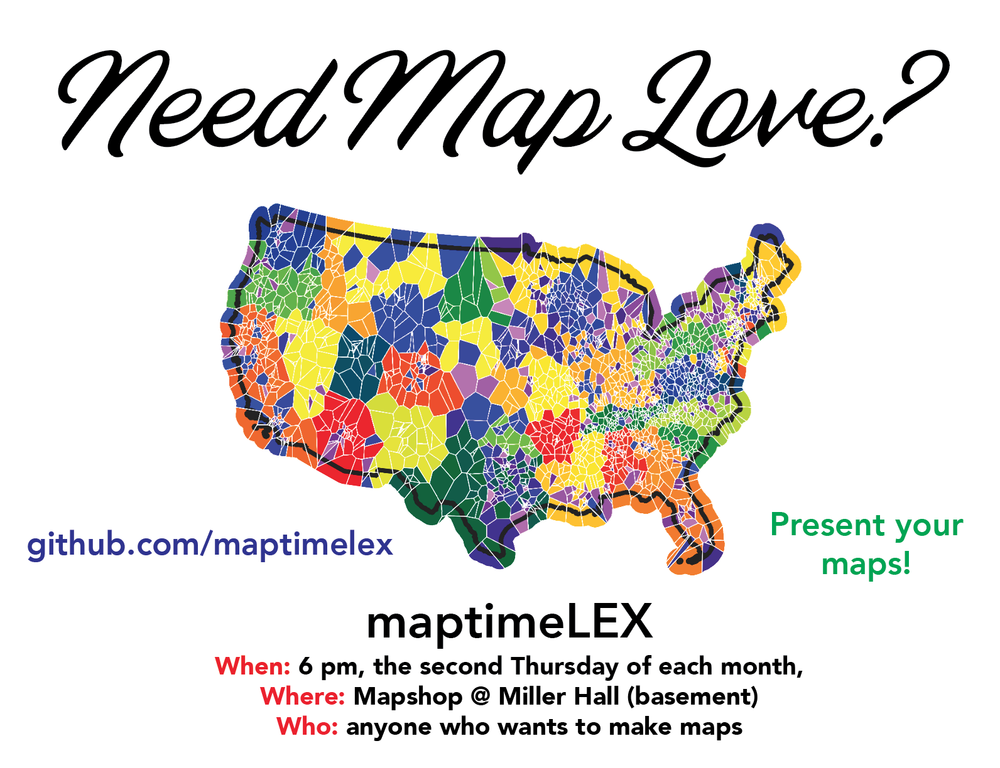

# Where is your nearest love?

Thursday, February 13, 6pm–7pm | Miller Hall basement ([map](https://maptimelex.github.io/location/)) 

A mapping project for Maptime Lex Valentine's Day Special.

## Valentine's Day Mapping

This project provides a high-level overview of a geospatial data project seeking to identify and map place names within the US containing Valentine's Day-related terms (such as "love" or "heart").

While the intent of maptimeLex event is fun (and perhaps a bit silly), we'll be introducing and covering the following process.

### 1. Data wrangling and transformation using Python within a Jupyter Notebook

Data source: [US Domestic Geographic Names Database](https://www.usgs.gov/core-science-systems/ngp/board-on-geographic-names/download-gnis-data).

Recommended: First create a new virtual environment and launch the .pynb Jupyter Notebook(s) within that. An example of the installed Python packages is here: [./notebooks.bio-env.txt](./notebooks.bio-env.txt). Comments within the code cells indicate what's happening.

The love_mapping.ipynb Notebook provides some preliminary loading, exploration, filtering, and transformation of the dataset. The key Python libraries employed are:

- [pandas](https://pandas.pydata.org/): used for quickly reading the tabular dataset into the Notebook, analyzing, and filtering
- [geopandas](https://geopandas.org/): used for quickly converting a pandas DataFrame (of tabular data) into a GeoDataFrame (with a geometry column attribute)
- [pysal](https://pysal.readthedocs.io/en/latest/index.html): used to analyze the filtered points and create Voronoi polygons

The standard-library-version.ipynb Notebook tests a similar process for filtering data and writing the resultant point features to GeoJSON.

### 2. Quick plotting and analysis within a web map

The second part of this maptimeLex continues the data flow process from the Python/Jupyter Notebook stage into the frontend web mapping stage.

For demonstration purposes, we use Python (and the GeoPandas library in particular), to write our point features containing the string value "love" to file: _data/love_points.json_.

We then load this file into an HTML document (_index.html_). The HTML requests and loads the following JavaScript libraries:

- [Leaflet](https://leafletjs.com/): the leading open-source JavaScript library for mobile-friendly interactive maps
- [d3-fetch](https://github.com/d3/d3-fetch): convenience module on to of the Fetch API, requests and parses data files into the DOM
- [Turf](https://turfjs.org/): library for geospatial analysis, performs a point in polygon test within this script to determine which point falls within any given voronoi polygon.

Resultant map can be viewed live: https://maptimelex.github.io/nearest-love/
